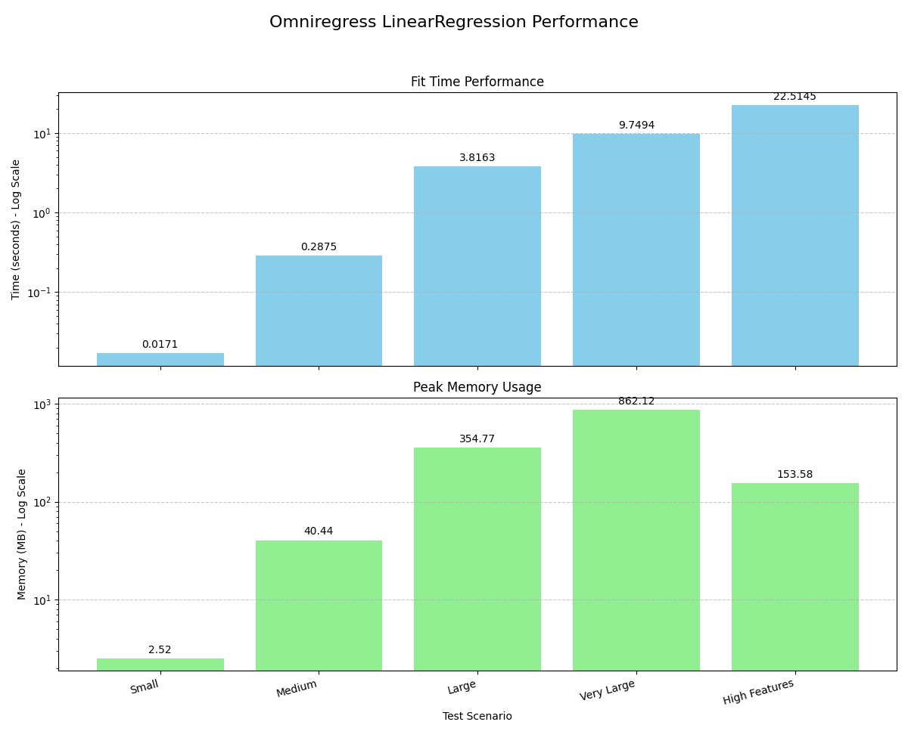

## 🚀 Performance Snapshot

Here's how `omniregress.LinearRegression` performs on various datasets.

| Scenario      | Samples     | Features | Fit Time (s) | Peak Memory (MB) |
|---------------|-------------|----------|--------------|------------------|
| Small         | 10,000      | 5        | 0.0171       | 2.52             |
| Medium        | 100,000     | 10       | 0.2875       | 40.44            |
| Large         | 500,000     | 20       | 3.8163       | 354.77           |
| Very Large    | 1,000,000   | 25       | 9.7494       | 862.12           |
| High Features | 10,000      | 500      | 22.5145      | 153.58           |

 

## Performance

**Results for `LinearRegression`**

| Scenario      | Samples     | Fit Time (s) |
|---------------|-------------|--------------|
| Small         | 10k         | 0.017        |
| Medium        | 100k        | 0.287        |
| Large         | 500k        | 3.816        |
| Very Large    | 1M          | 9.749        |
| High Features | 10k         | 22.514       |

*Tested on an Intel i5-8250U with 16 GB RAM.*